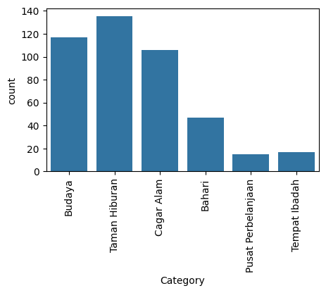
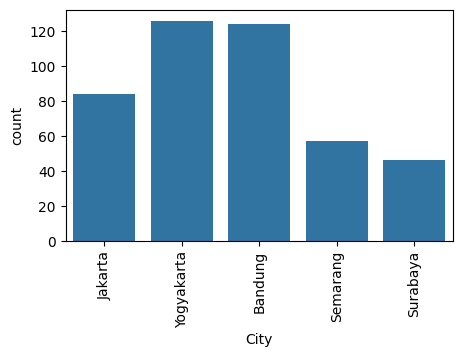
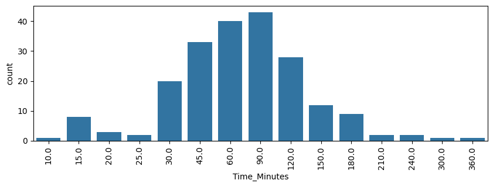
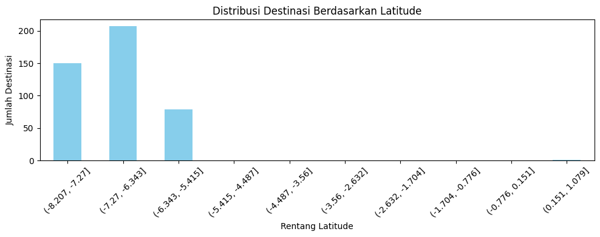
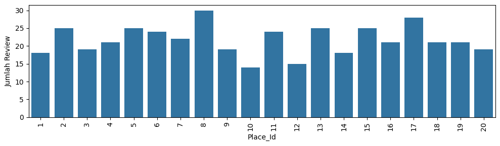
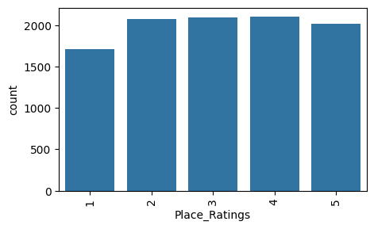

# Sistem Rekomendasi Destinasi Wisata di Indonesia

**Proyek Akhir - Machine Learning Terapan**  
**Nama**: Attiya Dianti Fadli  
**ID**: MC189D5X0806  

## Project Overview

**Latar Belakang Proyek**

Indonesia memiliki kekayaan destinasi wisata yang sangat beragam, mulai dari wisata alam, sejarah, budaya, hingga kuliner. Namun, dengan ribuan tempat wisata yang tersebar di seluruh nusantara, wisatawan sering mengalami kebingungan dalam menentukan tujuan wisata yang sesuai. Oleh karena itu, diperlukan sistem rekomendasi yang dapat membantu wisatawan dalam memilih destinasi berdasarkan preferensi mereka.

Sistem rekomendasi digunakan untuk membantu pengguna menemukan destinasi wisata yang relevan dan sesuai dengan preferensi mereka berdasarkan data rating pengguna sebelumnya.

**Mengapa proyek ini penting?**

Dengan perkembangan teknologi digital, wisatawan kini semakin mengandalkan platform digital untuk mencari inspirasi perjalanan. Sistem rekomendasi terbukti mampu meningkatkan kepuasan pengguna dan efisiensi dalam proses pencarian informasi. Menurut penelitian oleh [Gavalas et al., 2014](https://doi.org/10.1016/j.ijhcs.2014.01.006), sistem rekomendasi dalam domain pariwisata dapat membantu pengguna menavigasi opsi yang kompleks dan membuat keputusan berdasarkan preferensi personal.

Selain itu, sistem rekomendasi juga penting untuk mendorong pariwisata berkelanjutan dengan menyebarkan kunjungan tidak hanya ke destinasi populer, tetapi juga ke destinasi alternatif yang relevan namun kurang terekspos.

---

## Business Understanding

### Problem Statements
1. Wisatawan sering kali mengalami kesulitan dalam memilih destinasi wisata yang sesuai dengan preferensi pribadi mereka karena banyaknya pilihan yang tersedia.
2. Tidak semua pengguna memiliki histori interaksi yang cukup, sehingga menyulitkan sistem rekomendasi dalam memberikan saran yang akurat (masalah cold start).
3. Sebagian besar platform pariwisata belum menerapkan sistem rekomendasi yang personalisasi secara optimal.

### Goals
1. Mengembangkan sistem rekomendasi yang mampu menyarankan destinasi wisata berdasarkan rating atau preferensi pengguna sebelumnya.
2. Meningkatkan pengalaman pengguna dalam merencanakan perjalanan wisata dengan menyediakan daftar destinasi yang relevan dan menarik.
3. Menggabungkan dua pendekatan utama dalam sistem rekomendasi — content-based dan collaborative filtering — untuk menangani berbagai skenario pengguna.

### Solution statements
1. Mengimplementasikan pendekatan **content-based filtering** untuk menyarankan tempat wisata yang mirip dengan yang disukai pengguna sebelumnya berdasarkan deskripsi tempat.
2. Membangun model **collaborative filtering berbasis deep learning** menggunakan embedding untuk mempelajari pola interaksi pengguna-tempat.
3. Mengevaluasi sistem rekomendasi melalui metrik kesalahan prediksi (loss) dan kualitas saran yang dihasilkan untuk memastikan relevansi dan akurasi.

---

## Data Understanding

Dataset yang digunakan berasal dari Kaggle:  
📎 [Indonesia Tourism Destination Dataset](https://www.kaggle.com/datasets/aprabowo/indonesia-tourism-destination)

Dataset terbagi menjadi 2 yaitu place data dan place rating.

- Place data memiliki jumlah baris 437 dan kolom 13 tanpa missing value. Dataset ini berisikan tentang spesifikasi detail dari sebuah wisata, berikut adalah place data info dan sampel data:

| No | Nama Kolom     | Tipe Data |
|----|----------------|-----------|
| 0  | Place_Id       | int64     |
| 1  | Place_Name     | object    |
| 2  | Description    | object    |
| 3  | Category       | object    |
| 4  | City           | object    |
| 5  | Price          | int64     |
| 6  | Rating         | float64   |
| 7  | Time_Minutes   | float64   |
| 8  | Coordinate     | object    |
| 9  | Lat            | float64   |
| 10 | Long           | float64   |
| 11 | Unnamed: 11    | float64   |
| 12 | Unnamed: 12    | int64     |

- Place rating memiliki 10000 baris dan 3 kolom tanpa missing value. Dataset ini berisikan nilai rating yang diberikan user X terhadap place Y, berikut adalah place rating info dan sampel data:
  
| No | Nama Kolom    | Tipe Data |
|----|---------------|-----------|
| 0  | User_Id       | int64     |
| 1  | Place_Id      | int64     |
| 2  | Place_Ratings | int64     |

Berikut adalah variabel - variabel dari dataset:

1. data:
- `Place_Id`: ID unik untuk setiap destinasi wisata.
- `Place_Name`: Nama tempat atau destinasi wisata.
- `Description`: Deskripsi singkat mengenai tempat wisata tersebut.
- `Category`: Kategori wisata (misalnya alam, budaya, sejarah, dll).
- `City`: Kota tempat destinasi tersebut berada.
- `Price`: Estimasi biaya tiket masuk atau biaya kunjungan (dalam Rupiah).
- `Rating`: Rating rata-rata destinasi berdasarkan penilaian pengunjung (skala biasanya 1–5).
- `Time_Minutes`: Estimasi durasi kunjungan (dalam menit); nilai bisa kosong pada beberapa tempat.
- `Coordinate`: Lokasi geografis gabungan dalam bentuk teks (biasanya latitude,longitude).
- `Lat`: Latitude dari lokasi tempat wisata.
- `Long`: Longitude dari lokasi tempat wisata.
- `Unnamed`: 11: Kolom kosong
- `Unnamed`: 12: Kolom kosong

2. rating
- `User_Id`: ID unik untuk setiap pengguna.
- `Place_Id`: ID tempat wisata yang dirating (mengacu pada Place_Id di tourism_with_id.csv).
- `Place_Ratings`: Nilai rating yang diberikan pengguna terhadap tempat tertentu (skala biasanya 1–5).

**Exploratory Data Analysis (EDA)**

- Distribusi Kategori Wisata
  


Gambar ini menggambarkan jumlah kunjungan ke berbagai jenis tempat. Kategori Budaya mencatat jumlah kunjungan tertinggi, yaitu 130, diikuti oleh Taman Hiburan dengan total 120 kunjungan. Selanjutnya, Cagar Alam menunjukkan angka yang lebih rendah, sekitar 70 kunjungan, sementara Bahari memiliki 40 kunjungan. Terakhir, Pusat Pembelajaran dan Tempat Ibadah masing-masing hanya mendapatkan sekitar 20 kunjungan, yang merupakan jumlah terendah di antara semua kategori.

- Distribusi Daerah



Gambar ini menunjukkan jumlah kunjungan ke beberapa kota. Kategori Yogyakarta mencatat jumlah kunjungan tertinggi, mencapai 130. Diikuti oleh Bandung dengan total 120 kunjungan. Jakarta juga memiliki angka yang signifikan, sekitar 90 kunjungan. Sementara itu, Semarang mencatat sekitar 60 kunjungan, dan Surabaya memiliki jumlah terendah dengan sekitar 50 kunjungan.

- Distribusi Durasi Wisata



Gambar ini menggambarkan distribusi durasi wisata dalam satuan menit. Durasi sekitar 90 menit memiliki jumlah kunjungan tertinggi, mencapai 40. Kategori durasi 60 menit juga menunjukkan angka yang signifikan, dengan sekitar 35 kunjungan. Selain itu, durasi 45 menit dan 120 menit masing-masing mencatat sekitar 30 dan 25 kunjungan. Sementara itu, durasi yang lebih pendek, seperti 10 menit dan 15 menit, memiliki jumlah kunjungan yang jauh lebih rendah, menunjukkan bahwa pengunjung cenderung memilih durasi yang lebih lama untuk pengalaman wisata mereka.

- Distribusi Destinasi Berdasarkan Latitude



Gambar ini menunjukkan distribusi jumlah destinasi berdasarkan rentang latitude. Rentang (-8.207, -7.727) mencatat jumlah destinasi tertinggi, mencapai lebih dari 200. Rentang (-7.727, -6.343) juga menunjukkan angka yang signifikan, dengan sekitar 150 destinasi. Selanjutnya, rentang (-6.343, -5.453) memiliki jumlah destinasi yang lebih rendah, sekitar 100. Rentang (-5.453, -4.487) dan (-4.487, -3.628) masing-masing mencatat jumlah yang lebih sedikit, sementara rentang terakhir (-1.704, -0.511) menunjukkan jumlah destinasi terendah.

- Distribusi Kemunculan per Place_Id (urut berdasarkan ID)



Gambar ini menunjukkan distribusi kemunculan berdasarkan Place_Id yang diurutkan berdasarkan ID. Place_Id 8 mencatat jumlah review tertinggi, mencapai sekitar 30. Beberapa Place_Id lain, seperti 7 dan 17, juga menunjukkan angka yang signifikan dengan sekitar 25 review. Sebagian besar ID lainnya memiliki jumlah review yang relatif seimbang, berkisar antara 10 hingga 20. Secara keseluruhan, grafik ini mencerminkan variasi dalam jumlah review untuk setiap tempat.

- Distribusi Rating



Gambar ini menunjukkan distribusi rating berdasarkan Place_Ratings. Rating 2 tercatat sebagai yang tertinggi, dengan jumlah sekitar 2000. Rating 3, 4, dan 5 juga menunjukkan angka yang signifikan, masing-masing berada di kisaran yang sama. Namun, rating 1 memiliki jumlah yang jauh lebih rendah dibandingkan dengan rating lainnya. Secara keseluruhan, grafik ini mencerminkan bahwa sebagian besar rating berkisar di antara 2 hingga 5, dengan sedikit penilaian yang sangat rendah.

---

## Data Preparation

Pada tahap ini dilakukan serangkaian proses persiapan data sebelum digunakan dalam pemodelan. Data preparation bertujuan untuk memastikan kualitas data agar model yang dibangun dapat belajar secara optimal.

**Teknik Data Preparation**

Beberapa teknik data preparation yang digunakan antara lain:
1. **Penghapusan Data Duplikat dan Null**  
   Membersihkan data dari baris yang duplikat dan nilai kosong untuk menjaga integritas data.
2. **Label Encoding untuk ID Pengguna dan Tempat**  
   Mengubah `user_id` dan `place_id` menjadi angka agar bisa digunakan dalam model machine learning, khususnya pada model embedding.
3. **TF-IDF Vectorization pada Deskripsi Tempat**  
   Mengubah deskripsi tempat wisata menjadi vektor numerik berbasis frekuensi term menggunakan TF-IDF (Term Frequency - Inverse Document Frequency).
4. **Pemisahan Data Training dan Validation**  
   Membagi data rating menjadi data pelatihan dan validasi untuk evaluasi model collaborative filtering.

**Proses Data Preparation**
1. **Membaca dan Menggabungkan Dataset**  
   Dataset `tourism_rating.csv` dan `tourism_with_id.csv` digabungkan menggunakan `place_id` untuk mendapatkan informasi tempat wisata lengkap beserta rating dari pengguna.
2. **Menghapus Duplikat dan Nilai Kosong**  
   Fungsi `drop_duplicates()` dan `dropna()` digunakan untuk membersihkan data yang redundan atau hilang.
3. **Encoding ID**  
   Library `LabelEncoder` dari Scikit-learn digunakan untuk mengubah kolom `user_id` dan `place_id` menjadi nilai numerik yang unik.
4. **TF-IDF Vectorizer**  
   Deskripsi tempat wisata diolah dengan `TfidfVectorizer` untuk digunakan dalam content-based filtering. Hasilnya digunakan untuk menghitung cosine similarity antar tempat.
5. **Split Data**  
   Dataset rating dibagi menjadi data pelatihan dan validasi menggunakan `train_test_split` untuk keperluan pelatihan model collaborative filtering.

**Alasan Tahapan Data Preparation**
- **Menghapus duplikat dan null** bertujuan untuk mencegah bias dan error pada proses pelatihan model akibat data yang tidak konsisten.
- **Encoding ID** diperlukan karena model machine learning hanya bisa bekerja dengan data numerik. Label encoding memungkinkan kita merepresentasikan entitas kategori seperti `user_id` dan `place_id` dalam bentuk angka.
- **TF-IDF Vectorization** membantu mengubah teks deskriptif menjadi representasi numerik yang dapat digunakan untuk menghitung kemiripan antar tempat wisata.
- **Pemisahan data training dan validasi** diperlukan untuk mengukur performa model dan mencegah overfitting.

---

## Modeling

bantu saya membuat laporan berdasarkan file proyek yang saya lampirkan. laporan bagian modeling, buat markdown nya:

## Modeling

Pada tahap ini akan dibahas dua pendekatan utama yang digunakan dalam membangun sistem rekomendasi: **Content-Based Filtering** dan **Collaborative Filtering**. Masing-masing pendekatan memiliki parameter, kelebihan, dan kekurangan tersendiri. Berikut penjelasannya beserta potongan kode yang relevan.

**Model Sistem Rekomendasi: Content-Based Filtering**

Parameter yang Digunakan:
1. Fitur teks dari kategori tempat wisata
2. TF-IDF Vectorizer
3. Cosine Similarity

Tahapan proses:
1. Preprocessing data kategori tempat wisata.
2. Representasi fitur menggunakan TF-IDF.
3. Perhitungan similarity antar tempat berdasarkan fitur kategori.

Cara Kerja Algoritma:

Menggunakan pendekatan Content-Based Filtering dengan representasi vektor TF-IDF dari kolom kategori untuk mengukur kesamaan antar tempat wisata menggunakan cosine similarity.

Interaksi dengan Sampel Input:

Pengguna memilih tempat wisata yang disukai, sistem akan merekomendasikan tempat lain dengan kemiripan kategori yang tinggi.

**Top-N Recommendation Content Based Filtering**

- model_recommendations('Taman Hiburan')
| No |      Tempat Wisata      |
|----|-------------------------|
| 0  | Tugu Pal Putih Jogja    | 
| 1  | Surabaya North Quay     | 
| 2  | Grand Maerakaca         |
| 3  | Taman Cattleya          |
| 4  | Taman Pintar Yogyakarta |
  
- model_recommendations('Budaya')
| No |          Tempat Wisata        |
|----|-------------------------------|
| 0  | Museum Kereta Ambarawa        | 
| 1  | Kampung Wisata Sosro Menduran | 
| 2  | Museum Gedung Sate            |
| 3  | Museum Taman Prasasti         |
| 4  | De Mata Museum Jogja          |
  
**Model Sistem Rekomendasi Collaborative Filtering (Alternatif)**

Parameter yang Digunakan:
1. User ID dan Place ID
2. Model TensorFlow (Embedding layers)
3. Metode Matrix Factorization

Tahapan proses:
1. Encode user dan item.
2. Bangun model rekomendasi dengan pembelajaran fitur tersembunyi.
3. Lakukan training model dengan data interaksi user-item.
   
Cara Kerja Algoritma:

Menggunakan pendekatan Collaborative Filtering dengan TensorFlow. Model mempelajari representasi pengguna dan tempat dalam vektor embedding dan memprediksi rating atau interaksi antara pengguna dan tempat.

Interaksi dengan Sampel Input:

Sistem merekomendasikan tempat berdasarkan pola interaksi pengguna sebelumnya, seperti tempat yang pernah dikunjungi atau diberi rating tinggi.

**Top-N Recommendation Collaborative Filtering (Alternatif)**
```Menampilkan rekomendasi untuk user: 75
===========================
Tempat dengan rating tertinggi dari user:
- Pulau Pramuka
- Kawasan Wisata Sosrowijayan
- Goa Cerme
- Kota Tua
- Observatorium Bosscha
--------------------------------
Top 10 rekomendasi tempat wisata:
- La Kana Chapel
- Situs Warungboto
- Museum Tengah Kebun
- Monumen Selamat Datang
- Monumen Sanapati
- The Escape Hunt
- Taman Suropati
- Pemandian Air Panas Ciater
- Taman Situ Lembang
- Curug Aseupan
```

**Kelebihan dan Kekurangan Pendekatan**

1. Content Based Filtering
  - Kelebihan:
    - Tidak memerlukan data pengguna lain.
    - Dapat memberikan rekomendasi kepada pengguna baru.
  - Kekurangan:
    - Terbatas pada fitur yang diketahui.
    - Kurang mampu menemukan keterkaitan baru.

2. Collaborative Filtering
  - Kelebihan:
    - Dapat menemukan pola tersembunyi dari interaksi pengguna.
    - Menyesuaikan rekomendasi dengan preferensi komunitas.
  - Kekurangan:
    - Memerlukan data interaksi pengguna yang cukup.
    - Masalah cold-start untuk pengguna atau item baru.

---

## Evaluation

Pada bagian ini, akan dilakukan evaluasi terhadap model rekomendasi yang telah dibangun, dengan fokus pada model prediktif berbasis Collaborative Filtering menggunakan TensorFlow. Evaluasi dilakukan menggunakan metrik Root Mean Squared Error (RMSE) dan visualisasi training metric selama proses pelatihan.

**Metrik Evaluasi**

Root Mean Squared Error (RMSE) mengukur seberapa dekat prediksi model terhadap nilai aktual, dengan penalti lebih besar untuk kesalahan besar.

$$
\text{RMSE} = \sqrt{\frac{1}{n} \sum_{i=1}^{n} (y_i - \hat{y}_i)^2}
$$

Keterangan:

- $y_i$ = nilai aktual  
- $\hat{y}_i$ = nilai prediksi  
- $n$ = jumlah data

**Hasil Evaluasi**
|            | Train  | Test  |
|------------|--------|-------|
| RMSE       | 0.1928 | 0.6132|

Model menunjukkan performa baik pada data pelatihan, dan performa yang masih dapat diterima pada data pengujian. Hal ini menunjukkan potensi overfitting ringan.

**Grafik Proses Training**

Berikut adalah visualisasi proses pelatihan model berdasarkan metrik **MSE** dan **MAE** untuk data pelatihan dan validasi:


**Interpretasi dari Grafik:**

- **Train Loss (MSE)**: Terlihat menurun secara konsisten, menunjukkan bahwa model belajar dari data pelatihan dengan baik.
- **Val Loss (MSE)**: Relatif konstan di sekitar 0.46, mengindikasikan bahwa model belum mampu meningkatkan performa pada data validasi.
- **Train MAE**: Menurun secara signifikan, menunjukkan penurunan rata-rata kesalahan absolut selama pelatihan.
- **Val MAE**: Stabil di sekitar 0.61, menandakan kemungkinan **overfitting**, karena model tidak memperbaiki kinerjanya terhadap data yang belum dilihat.

**Evaluasi Terhadap Business Understanding**

- Menjawab Problem Statement:
  Model berhasil memberikan rekomendasi yang relevan berdasarkan preferensi pengguna dan data historis.

- Mencapai Goals:
  Sistem rekomendasi mencapai tujuan untuk memberikan hasil yang relevan baik melalui pendekatan berbasis konten maupun kolaboratif.

- Dampak dari Solusi:
  Penggunaan dua pendekatan memberikan fleksibilitas dan akurasi lebih baik, serta meningkatkan pengalaman pengguna melalui rekomendasi yang lebih personal.

---

## Kesimpulan

Melalui pendekatan **Content-Based Filtering** dan **Collaborative Filtering**, sistem rekomendasi yang dibangun mampu memberikan rekomendasi yang personal dan relevan:

- **Content-Based Filtering** bekerja efektif dengan atribut tempat wisata (misalnya kategori dan deskripsi).
- **Collaborative Filtering** mampu menangkap preferensi pengguna berdasarkan histori interaksi.

Evaluasi dengan metrik RMSE, MSE, dan MAE menunjukkan bahwa model memiliki performa yang baik pada data pelatihan, namun perlu peningkatan pada generalisasi ke data validasi. Kombinasi pendekatan dan analisis metrik memberikan solusi yang komprehensif dan dapat digunakan sebagai dasar pengembangan sistem rekomendasi lebih lanjut.

---

## Referensi

- Gavalas, D., Konstantopoulos, C., Mastakas, K., & Pantziou, G. (2014). **"Mobile recommender systems in tourism"**, *International Journal of Human-Computer Studies*, 106–118. [https://doi.org/10.1016/j.ijhcs.2014.01.006](https://doi.org/10.1016/j.ijhcs.2014.01.006)
- Ricci, F., Rokach, L., & Shapira, B. (2011). **"Introduction to Recommender Systems Handbook"**. Springer.
- Dataset: [Indonesia Tourism Destination - Kaggle](https://www.kaggle.com/datasets/aprabowo/indonesia-tourism-destination)
- Dokumentasi TensorFlow
- Scikit-learn Documentation
