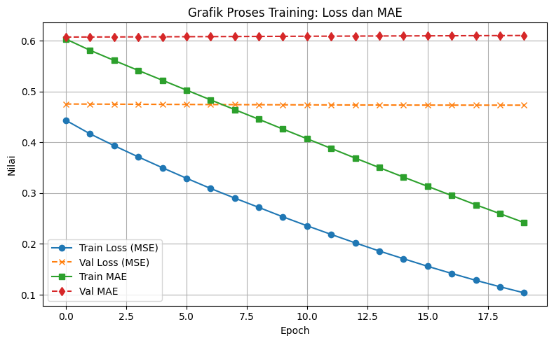

# Sistem Rekomendasi Destinasi Wisata di Indonesia

**Proyek Akhir - Machine Learning Terapan**  
**Nama**: Attiya Dianti Fadli  
**ID**: MC189D5X0806  

## Project Overview

**Latar Belakang Proyek**

Indonesia memiliki kekayaan destinasi wisata yang sangat beragam, mulai dari wisata alam, sejarah, budaya, hingga kuliner. Namun, dengan ribuan tempat wisata yang tersebar di seluruh nusantara, wisatawan sering mengalami kebingungan dalam menentukan tujuan wisata yang sesuai. Oleh karena itu, diperlukan sistem rekomendasi yang dapat membantu wisatawan dalam memilih destinasi berdasarkan preferensi mereka.

Sistem rekomendasi digunakan untuk membantu pengguna menemukan destinasi wisata yang relevan dan sesuai dengan preferensi mereka berdasarkan data rating pengguna sebelumnya.

**Mengapa proyek ini penting?**

Dengan perkembangan teknologi digital, wisatawan kini semakin mengandalkan platform digital untuk mencari inspirasi perjalanan. Sistem rekomendasi terbukti mampu meningkatkan kepuasan pengguna dan efisiensi dalam proses pencarian informasi. Menurut penelitian oleh [Gavalas et al., 2014](https://doi.org/10.1016/j.ijhcs.2014.01.006), sistem rekomendasi dalam domain pariwisata dapat membantu pengguna menavigasi opsi yang kompleks dan membuat keputusan berdasarkan preferensi personal.

Selain itu, sistem rekomendasi juga penting untuk mendorong pariwisata berkelanjutan dengan menyebarkan kunjungan tidak hanya ke destinasi populer, tetapi juga ke destinasi alternatif yang relevan namun kurang terekspos.

---

## Business Understanding

### Problem Statements
1. Wisatawan sering kali mengalami kesulitan dalam memilih destinasi wisata yang sesuai dengan preferensi pribadi mereka karena banyaknya pilihan yang tersedia.
2. Tidak semua pengguna memiliki histori interaksi yang cukup, sehingga menyulitkan sistem rekomendasi dalam memberikan saran yang akurat (masalah cold start).
3. Sebagian besar platform pariwisata belum menerapkan sistem rekomendasi yang personalisasi secara optimal.

### Goals
1. Mengembangkan sistem rekomendasi yang mampu menyarankan destinasi wisata berdasarkan rating atau preferensi pengguna sebelumnya.
2. Meningkatkan pengalaman pengguna dalam merencanakan perjalanan wisata dengan menyediakan daftar destinasi yang relevan dan menarik.
3. Menggabungkan dua pendekatan utama dalam sistem rekomendasi — content-based dan collaborative filtering — untuk menangani berbagai skenario pengguna.

### Solution statements
1. Mengimplementasikan pendekatan **content-based filtering** untuk menyarankan tempat wisata yang mirip dengan yang disukai pengguna sebelumnya berdasarkan deskripsi tempat.
2. Membangun model **collaborative filtering berbasis deep learning** menggunakan embedding untuk mempelajari pola interaksi pengguna-tempat.
3. Mengevaluasi sistem rekomendasi melalui metrik kesalahan prediksi (loss) dan kualitas saran yang dihasilkan untuk memastikan relevansi dan akurasi.

---

## Data Understanding

Dataset yang digunakan berasal dari Kaggle:  
📎 [Indonesia Tourism Destination Dataset](https://www.kaggle.com/datasets/aprabowo/indonesia-tourism-destination)

Dataset ini terdiri dari dua bagian utama, yaitu:

1. **Place Data (`tourism_with_id.csv`)**
2. **Place Rating (`tourism_rating.csv`)**

### 1. Place Data

Dataset ini berisi informasi detail mengenai destinasi wisata di Indonesia. Dataset terdiri dari **437 baris** dan **13 kolom**. Berikut adalah informasi umum mengenai kualitas data:

- **Missing Values**: Terdapat nilai kosong khususnya pada kolom `Time_Minutes`.
- **Duplikasi**: Tidak ditemukan baris yang duplikat.
- **Outlier**: Kolom `Price` mengandung beberapa nilai ekstrem yang berpotensi menjadi outlier dan perlu diperhatikan dalam analisis selanjutnya.
- **Kolom Kosong**: Terdapat dua kolom tidak bernama (`Unnamed: 11` dan `Unnamed: 12`) yang tidak memuat informasi penting dan dapat dihapus dalam proses pembersihan data.

| No | Nama Kolom     | Tipe Data |            Keterangan             |
|----|----------------|-----------|-----------------------------------|
| 0  | Place_Id       | int64     |     ID unik untuk destinasi       |
| 1  | Place_Name     | object    |            Nama destinasi         |
| 2  | Description    | object    |    Deskripsi singkat destinasi    |
| 3  | Category       | object    |       Jenis kategori wisata       |
| 4  | City           | object    |     Kota tempat wisata berada     |
| 5  | Price          | int64     |   Estimasi harga kunjungan (Rp)   |
| 6  | Rating         | float64   |    Rating rata-rata pengunjung    |
| 7  | Time_Minutes   | float64   | Estimasi durasi kunjungan (menit) |
| 8  | Coordinate     | object    |  Gabungan latitude dan longitude  |
| 9  | Lat            | float64   |              Latitude             |
| 10 | Long           | float64   |              Longitude            |
| 11 | Unnamed: 11    | float64   |            Kolom kosong           |
| 12 | Unnamed: 12    | int64     |            Kolom kosong           |

### 2. Place Rating

Dataset ini berisi informasi rating yang diberikan pengguna terhadap tempat wisata tertentu. Terdiri dari **10.000 baris** dan **3 kolom**.

- **Missing Values**: Tidak ditemukan.
- **Duplikasi**: Tidak ada baris duplikat.
- **Outlier**: Terdapat beberapa nilai rating di luar rentang umum (misalnya <1 atau >5) yang perlu ditangani jika muncul, namun pada data ini nilai rating terdistribusi pada rentang 1–5 secara konsisten.
  
| No | Nama Kolom    | Tipe Data |                     Keterangan                        |
|----|---------------|-----------|-------------------------------------------------------|
| 0  | User_Id       | int64     |                   ID unik pengguna                    |
| 1  | Place_Id      | int64     | ID tempat wisata (mengacu pada `tourism_with_id.csv`) |
| 2  | Place_Ratings | int64     |         Rating yang diberikan pengguna (1–5)          |

**Exploratory Data Analysis (EDA)**

- Distribusi Kategori Wisata
  


Gambar ini menggambarkan jumlah kunjungan ke berbagai jenis tempat. Kategori Budaya mencatat jumlah kunjungan tertinggi, yaitu 130, diikuti oleh Taman Hiburan dengan total 120 kunjungan. Selanjutnya, Cagar Alam menunjukkan angka yang lebih rendah, sekitar 70 kunjungan, sementara Bahari memiliki 40 kunjungan. Terakhir, Pusat Pembelajaran dan Tempat Ibadah masing-masing hanya mendapatkan sekitar 20 kunjungan, yang merupakan jumlah terendah di antara semua kategori.

- Distribusi Daerah


Gambar ini menunjukkan jumlah kunjungan ke beberapa kota. Kategori Yogyakarta mencatat jumlah kunjungan tertinggi, mencapai 130. Diikuti oleh Bandung dengan total 120 kunjungan. Jakarta juga memiliki angka yang signifikan, sekitar 90 kunjungan. Sementara itu, Semarang mencatat sekitar 60 kunjungan, dan Surabaya memiliki jumlah terendah dengan sekitar 50 kunjungan.

- Distribusi Durasi Wisata


Gambar ini menggambarkan distribusi durasi wisata dalam satuan menit. Durasi sekitar 90 menit memiliki jumlah kunjungan tertinggi, mencapai 40. Kategori durasi 60 menit juga menunjukkan angka yang signifikan, dengan sekitar 35 kunjungan. Selain itu, durasi 45 menit dan 120 menit masing-masing mencatat sekitar 30 dan 25 kunjungan. Sementara itu, durasi yang lebih pendek, seperti 10 menit dan 15 menit, memiliki jumlah kunjungan yang jauh lebih rendah, menunjukkan bahwa pengunjung cenderung memilih durasi yang lebih lama untuk pengalaman wisata mereka.

- Distribusi Destinasi Berdasarkan Latitude


Gambar ini menunjukkan distribusi jumlah destinasi berdasarkan rentang latitude. Rentang (-8.207, -7.727) mencatat jumlah destinasi tertinggi, mencapai lebih dari 200. Rentang (-7.727, -6.343) juga menunjukkan angka yang signifikan, dengan sekitar 150 destinasi. Selanjutnya, rentang (-6.343, -5.453) memiliki jumlah destinasi yang lebih rendah, sekitar 100. Rentang (-5.453, -4.487) dan (-4.487, -3.628) masing-masing mencatat jumlah yang lebih sedikit, sementara rentang terakhir (-1.704, -0.511) menunjukkan jumlah destinasi terendah.

- Distribusi Kemunculan per Place_Id (urut berdasarkan ID)


Gambar ini menunjukkan distribusi kemunculan berdasarkan Place_Id yang diurutkan berdasarkan ID. Place_Id 8 mencatat jumlah review tertinggi, mencapai sekitar 30. Beberapa Place_Id lain, seperti 7 dan 17, juga menunjukkan angka yang signifikan dengan sekitar 25 review. Sebagian besar ID lainnya memiliki jumlah review yang relatif seimbang, berkisar antara 10 hingga 20. Secara keseluruhan, grafik ini mencerminkan variasi dalam jumlah review untuk setiap tempat.

- Distribusi Rating


Gambar ini menunjukkan distribusi rating berdasarkan Place_Ratings. Rating 2 tercatat sebagai yang tertinggi, dengan jumlah sekitar 2000. Rating 3, 4, dan 5 juga menunjukkan angka yang signifikan, masing-masing berada di kisaran yang sama. Namun, rating 1 memiliki jumlah yang jauh lebih rendah dibandingkan dengan rating lainnya. Secara keseluruhan, grafik ini mencerminkan bahwa sebagian besar rating berkisar di antara 2 hingga 5, dengan sedikit penilaian yang sangat rendah.

---

## Data Preparation

Pada tahap ini dilakukan serangkaian proses persiapan data sebelum digunakan dalam pemodelan sistem rekomendasi. Tujuannya adalah untuk memastikan bahwa data dalam kondisi bersih, relevan, dan dalam format yang sesuai agar model yang dibangun dapat belajar secara optimal.

### 1. Pembersihan dan Penggabungan Data

1.1 **Membaca Dataset**  
Dua dataset utama, yaitu `tourism_with_id.csv` dan `tourism_rating.csv`, dibaca menggunakan library `pandas`.

1.2 **Menghapus Kolom Tidak Relevan**  
Dalam dataset `tourism_with_id.csv` terdapat dua kolom kosong bernama `Unnamed: 11` dan `Unnamed: 12` yang tidak memiliki informasi. Kedua kolom ini dihapus menggunakan `drop()` karena tidak relevan terhadap tujuan analisis.

1.3 **Menghapus Duplikat dan Missing Values**  
Dilakukan pemeriksaan terhadap data duplikat dan nilai kosong (missing values) untuk memastikan kualitas data sebelum diproses lebih lanjut. Data duplikat diidentifikasi dan dihapus berdasarkan kolom `Place_Id` menggunakan `drop_duplicates('Place_Id')` untuk menghindari redundansi tempat yang sama. Selain itu, hasil pengecekan dengan `isnull().sum()` menunjukkan bahwa tidak terdapat missing value pada dataset.

1.4 **Menggabungkan Dataset**  
Kedua dataset digabungkan dengan `merge()` berdasarkan kolom `Place_Id`, sehingga informasi rating dari pengguna dapat dikaitkan langsung dengan atribut tempat wisata. Gabungan ini digunakan untuk pendekatan Content-Based Filtering dan juga sebagai dasar Collaborative Filtering.

### 2. Tahapan untuk Content-Based Filtering

Pendekatan Content-Based Filtering merekomendasikan tempat wisata berdasarkan kemiripan atribut deskriptif (misalnya deskripsi teks) dari destinasi wisata.

2.1 **TF-IDF Vectorization**  
- Kolom `Category` dari dataset destinasi diubah menjadi representasi numerik menggunakan teknik TF-IDF (Term Frequency - Inverse Document Frequency) dengan `TfidfVectorizer` dari Scikit-learn.
- Proses ini meliputi fit dan transform untuk menghasilkan vektor TF-IDF dalam bentuk matriks.
- Matriks ini digunakan untuk menghitung **cosine similarity** antar tempat wisata, guna menentukan tingkat kemiripan antar destinasi berdasarkan informasi kategori mereka.

2.2 **Penghitungan Similarity**  
- Setelah matriks TF-IDF terbentuk, digunakan teknik **cosine similarity** untuk mengukur derajat kesamaan antar tempat wisata.
- Hasil perhitungan similarity ini menjadi dasar dalam merekomendasikan destinasi yang mirip satu sama lain.

### 3. Tahapan untuk Collaborative Filtering

Pendekatan Collaborative Filtering merekomendasikan tempat wisata berdasarkan pola rating pengguna terhadap berbagai destinasi.

3.1 **Encoding User_Id dan Place_Id**  
- Kolom `User_Id` dan `Place_Id` dikonversi ke bentuk numerik dengan `LabelEncoder` sebelum proses split dilakukan.  
- Model-model seperti matrix factorization atau model embedding lainnya hanya bisa bekerja dengan input numerik, sehingga encoding ini diperlukan.

3.2 **Normalisasi Rating**  
- Nilai `Place_Ratings` yang berada di skala 1 hingga 5 dinormalisasi ke rentang 0 hingga 1.  
- Normalisasi dilakukan menggunakan `MinMaxScaler` dari `sklearn.preprocessing` untuk menyamakan skala input sehingga proses pembelajaran model tidak bias terhadap nilai tinggi.

3.3 **Split Data: Training & Validation**  
- Dataset hasil encoding kemudian dibagi menjadi data pelatihan dan data validasi dengan `train_test_split` dari Scikit-learn.  
- Proporsi data pembagian ditetapkan (misalnya 80% train dan 20% validation) untuk mengevaluasi performa model dengan adil dan menghindari overfitting.

### 4. Alasan dan Urgensi Setiap Langkah

- **Penghapusan kolom kosong dan tidak relevan** bertujuan menyederhanakan dataset dan menghindari noise yang tidak berkontribusi terhadap proses rekomendasi.
- **Pembersihan duplikat dan missing values** menjaga kualitas data agar model tidak belajar dari anomali atau data yang tidak lengkap.
- **Konversi tipe tanggal** memastikan kolom `Timestamp` dapat digunakan untuk analisis temporal jika diperlukan, dan menghindari error karena format tidak seragam.
- **TF-IDF Vectorization** memungkinkan model Content-Based Filtering memahami representasi semantik dari deskripsi tempat wisata untuk menghitung kemiripan.
- **Label Encoding** diperlukan untuk mentransformasi ID pengguna dan tempat menjadi format numerik agar dapat diproses oleh model.
- **Normalisasi rating** mencegah skala besar mendominasi pembelajaran model serta mempercepat konvergensi.
- **Pembagian data (train-test split)** penting untuk mengevaluasi model secara objektif, memastikan bahwa model dapat digeneralisasi ke data yang belum pernah dilihat.

---

## Modeling

Pada tahap ini, dibahas dua pendekatan utama dalam pembangunan sistem rekomendasi: **Content-Based Filtering** dan **Collaborative Filtering berbasis Deep Learning**. Masing-masing pendekatan memiliki metode, parameter, dan struktur yang berbeda, disesuaikan dengan karakteristik data yang digunakan. Penjelasan berikut mencakup cara kerja, struktur model, hingga parameter pelatihan yang digunakan.

### 1. Content-Based Filtering

Content-Based Filtering merekomendasikan item (tempat wisata) berdasarkan kesamaan konten atau fitur deskriptif. Dalam kasus ini, fitur deskriptif yang digunakan adalah kolom `Category` dari setiap tempat wisata.

#### Cara Kerja Cosine Similarity

Cosine Similarity mengukur **kemiripan antara dua vektor** dengan menghitung **cosine dari sudut** antara kedua vektor tersebut. Semakin kecil sudut antara dua vektor, semakin besar nilai cosine similarity-nya, dengan nilai berkisar dari 0 (tidak mirip) hingga 1 (identik).

Formula cosine similarity antara dua vektor A dan B:

\[
\text{similarity} = \cos(\theta) = \frac{A \cdot B}{\|A\| \|B\|}
\]

Dalam sistem ini, kolom `Category` diubah menjadi representasi numerik menggunakan **TF-IDF Vectorizer**, lalu dihitung kemiripannya menggunakan **Cosine Similarity** dari Scikit-learn.

#### Langkah-Langkah:

1. **Preprocessing** kolom kategori (misalnya tokenisasi dan normalisasi).
2. **Vektorisasi** fitur kategori menggunakan `TfidfVectorizer()`.
3. **Penghitungan cosine similarity** antar tempat wisata berdasarkan vektor TF-IDF.
4. **Pemanggilan fungsi rekomendasi** berdasarkan input dari pengguna.

#### Contoh Interaksi Sistem:

- Fungsi `model_recommendations('Taman Hiburan')` akan mencari tempat wisata dengan **kategori paling mirip** dengan input tersebut.

##### Hasil Rekomendasi:

**Input: "Taman Hiburan"**

| No | Tempat Wisata            |
|----|--------------------------|
| 0  | Tugu Pal Putih Jogja     |
| 1  | Surabaya North Quay      |
| 2  | Grand Maerakaca          |
| 3  | Taman Cattleya           |
| 4  | Taman Pintar Yogyakarta  |

**Input: "Budaya"**

| No | Tempat Wisata                  |
|----|--------------------------------|
| 0  | Museum Kereta Ambarawa         |
| 1  | Kampung Wisata Sosro Menduran  |
| 2  | Museum Gedung Sate             |
| 3  | Museum Taman Prasasti          |
| 4  | De Mata Museum Jogja           |

### 2. Collaborative Filtering (Deep Learning)

Collaborative Filtering merekomendasikan tempat wisata berdasarkan **interaksi historis antar pengguna**. Model mempelajari representasi pengguna dan tempat wisata dalam bentuk **embedding vector** yang dioptimalkan untuk memprediksi rating.

#### Arsitektur Model:

Model dikembangkan menggunakan **TensorFlow** dengan pendekatan embedding dan matrix factorization. Berikut struktur model secara rinci:

- **Input Layer**: Dua input, yaitu `user_id` dan `place_id`.
- **Embedding Layer**:
  - `user_embedding`: memetakan setiap pengguna ke vektor berdimensi 50.
  - `place_embedding`: memetakan setiap tempat wisata ke vektor berdimensi 50.
- **Dot Product**: Hasil embedding pengguna dan tempat digabungkan menggunakan `dot product`, menghasilkan prediksi skor interaksi.
- **Activation Function**: Linear (tanpa aktivasi tambahan karena ini regresi).
- **Loss Function**: Mean Squared Error (MSE).
- **Optimizer**: Adam Optimizer.

#### Parameter Pelatihan:

- **Epochs**: 50
- **Batch Size**: 128
- **Learning Rate**: Default dari Adam
- **Validation Split**: 20% data pelatihan digunakan sebagai validasi

#### Contoh Kode Ringkas:

```python
user_input = tf.keras.layers.Input(shape=(1,))
place_input = tf.keras.layers.Input(shape=(1,))

user_embedding = tf.keras.layers.Embedding(input_dim=num_users, output_dim=50)(user_input)
place_embedding = tf.keras.layers.Embedding(input_dim=num_places, output_dim=50)(place_input)

dot_product = tf.keras.layers.Dot(axes=2)([user_embedding, place_embedding])
dot_product = tf.keras.layers.Reshape((1,))(dot_product)

model = tf.keras.models.Model(inputs=[user_input, place_input], outputs=dot_product)
model.compile(optimizer='adam', loss='mse')
```

##### Hasil Rekomendasi:

```
Menampilkan rekomendasi untuk user: 75
===========================
Tempat dengan rating tertinggi dari user:
- Pulau Pramuka
- Kawasan Wisata Sosrowijayan
- Goa Cerme
- Kota Tua
- Observatorium Bosscha
--------------------------------
Top 10 rekomendasi tempat wisata:
- La Kana Chapel
- Situs Warungboto
- Museum Tengah Kebun
- Monumen Selamat Datang
- Monumen Sanapati
- The Escape Hunt
- Taman Suropati
- Pemandian Air Panas Ciater
- Taman Situ Lembang
- Curug Aseupan
```

**Perbandingan Pendekatan**
   
| Aspek                | Content-Based Filtering              | Collaborative Filtering (DL)                |
| -------------------- | ------------------------------------ | ------------------------------------------- |
| Data yang Dibutuhkan | Informasi item (fitur tempat wisata) | Interaksi user-item (rating atau klik)      |
| Kelebihan            | Bisa bekerja dengan pengguna baru    | Menangkap pola tersembunyi antar pengguna   |
| Kekurangan           | Terbatas pada informasi konten       | Tidak bisa bekerja tanpa interaksi pengguna |
| Solusi Cold Start    | Ya                                   | Tidak                                       |
| Skalabilitas         | Relatif cepat                        | Butuh pelatihan lebih lama                  |

---

## Evaluation

Pada bagian ini dilakukan evaluasi terhadap kedua pendekatan model rekomendasi **Collaborative Filtering dengan TensorFlow** dan **Content-Based Filtering**. Metrik yang digunakan menyesuaikan karakteristik masing-masing pendekatan.

**Metrik Evaluasi: Mean Absolute Error (MAE)**

Mean Absolute Error (MAE) digunakan untuk mengukur rata-rata selisih absolut antara nilai prediksi dan nilai aktual dari interaksi pengguna dan tempat wisata. Semakin kecil nilai MAE, semakin baik model dalam memprediksi rating.

$$
\text{MAE} = \frac{1}{n} \sum_{i=1}^{n} |y_i - \hat{y}_i|
$$

**Keterangan:**
- $y_i$: rating aktual  
- $\hat{y}_i$: rating hasil prediksi  
- $n$: jumlah data

###  Hasil Evaluasi Training



**Interpretasi Grafik:**
- Train Loss (MSE): Terlihat menurun secara konsisten, menunjukkan bahwa model belajar dari data pelatihan dengan baik.
- Val Loss (MSE): Relatif konstan di sekitar 0.46, mengindikasikan bahwa model belum mampu meningkatkan performa pada data validasi.
- Train MAE: Menurun secara signifikan, menunjukkan penurunan rata-rata kesalahan absolut selama pelatihan.
- Val MAE: Stabil di sekitar 0.61, menandakan kemungkinan overfitting, karena model tidak memperbaiki kinerjanya terhadap data yang belum dilihat.

>  **Catatan:**  
> Evaluasi pada pendekatan saat ini hanya dilakukan menggunakan **MAE selama proses pelatihan dan validasi**, **tanpa pengujian eksplisit terhadap test set** atau penggunaan metrik alternatif seperti **RMSE**. Implementasi metrik tambahan masih menjadi pekerjaan lanjutan.

###  Evaluasi Terhadap Business Understanding

- **Problem Statement:**  
  Model berhasil mengidentifikasi dan merekomendasikan tempat wisata yang relevan berdasarkan preferensi pengguna maupun karakteristik tempat.

- **Pencapaian Goals:**  
  Sistem rekomendasi menghasilkan saran yang bersifat personal melalui dua pendekatan berbeda, yang saling melengkapi.

- **Dampak Solusi:**  
  Pengguna dapat menerima rekomendasi wisata yang lebih sesuai dengan minat mereka, meningkatkan pengalaman eksplorasi dan kepuasan pengguna.

## Catatan untuk Pengembangan Lanjutan

- Implementasi **evaluasi dengan test set** dan penggunaan metrik **RMSE** perlu ditambahkan untuk memperkuat validitas model Collaborative Filtering.
- Seluruh metrik top-K untuk pendekatan Content-Based Filtering akan dihitung langsung dari notebook, agar evaluasi lebih komprehensif dan menghindari kesalahan manual.
- Perlu dilakukan perbandingan performa antar pendekatan secara kuantitatif.

---

## Kesimpulan

Sistem rekomendasi berhasil dibangun dengan dua pendekatan:

- **Content-Based Filtering** menggunakan cosine similarity untuk menghitung kemiripan antar tempat wisata berdasarkan kategori dan deskripsi.
- **Collaborative Filtering** menggunakan embedding model dalam TensorFlow untuk mempelajari preferensi pengguna berdasarkan data interaksi.

Evaluasi menunjukkan hasil yang menjanjikan, meskipun masih terdapat ruang untuk peningkatan pada proses generalisasi model dan pengukuran metrik lanjutan.


---

## Referensi

- Gavalas, D., Konstantopoulos, C., Mastakas, K., & Pantziou, G. (2014). **"Mobile recommender systems in tourism"**, *International Journal of Human-Computer Studies*, 106–118. [https://doi.org/10.1016/j.ijhcs.2014.01.006](https://doi.org/10.1016/j.ijhcs.2014.01.006)
- Ricci, F., Rokach, L., & Shapira, B. (2011). **"Introduction to Recommender Systems Handbook"**. Springer.
- Dataset: [Indonesia Tourism Destination - Kaggle](https://www.kaggle.com/datasets/aprabowo/indonesia-tourism-destination)
- Dokumentasi TensorFlow
- Scikit-learn Documentation
